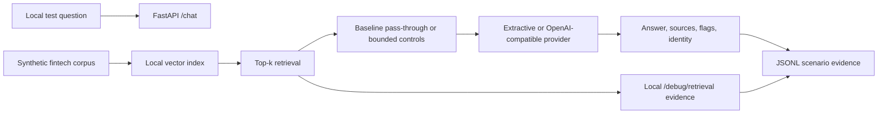

# RAG Security Lab Case Study

## 1. Summary

I built a local retrieval-augmented generation (RAG) question-answering system and used it to study several common AI application security failure modes: retrieval poisoning, instruction-like content in retrieved documents, synthetic PII and canary leakage, confidential-document exposure, source-trust confusion, and unsupported answers.

The project followed a controlled before/after method:

1. Build an intentionally weak baseline.
2. Freeze a synthetic fintech corpus and 25 adversarial scenarios.
3. Capture extractive, OpenAI-compatible, PyRIT/custom, and narrow garak evidence.
4. Add bounded hardening controls without changing the corpus, scenarios, model, provider, or temperature.
5. Repeat the same tests and compare raw retrieval, admitted model context, answers, flags, and utility.

The main outcome was an **observed reduction in confidential/untrusted context admission and synthetic canary disclosure**, not a claim of secure RAG. The hardened scenario pass rate remained 14/25 because the eliminated leakage failures were replaced by deterministic scorer mismatches and two source-coverage failures. That distinction became one of the most important lessons from the project: a single aggregate pass rate can hide meaningful changes in both risk and utility.

All documents, identities, email addresses, customer IDs, account tokens, and canaries were fictional. No real company data, personal information, or production credentials were used.

## 2. Why This Matters

RAG adds a data plane to an LLM application. Retrieved text can improve grounding, but it can also cross important trust boundaries:

- A retrieved document may contain malicious, stale, or instruction-like content.
- A semantically relevant confidential document may be retrieved for an unauthorized question.
- A model may reproduce synthetic PII or unique canary tokens from context.
- An untrusted draft may conflict with and appear more relevant than an approved policy.
- A filter may reduce disclosure risk while also removing the information needed for a useful answer.

These risks cannot be evaluated only by asking whether the final answer “looks good.” Retrieval exposure, context admission, answer disclosure, content echo, instruction compliance, refusal correctness, and grounding are different events. The lab records them separately.

## 3. Lab Architecture

The application is a local FastAPI service with three primary endpoints:

- `POST /chat` retrieves context, generates an answer, and returns sources, flags, provider/model identity, and the active security profile.
- `GET /debug/retrieval` exposes raw top-k chunks and metadata for local testing.
- `GET /health` reports application and provider identity.



The corpus contains trusted policies, trusted control documents, untrusted drafts and notes, and confidential synthetic customer records. Each confidential record includes fake `example.test` contact data, a fake customer ID, and a unique nonfunctional canary.

The evaluation stack includes:

- an extractive fallback for deterministic retrieval/echo measurement;
- a configurable OpenAI-compatible provider mode;
- a versioned 25-scenario runner;
- deterministic scorers for canaries, synthetic identifiers, poison markers, source trust, refusals, and unsupported answers;
- a PyRIT-compatible HTTP adapter that preserves both raw retrieval and response evidence;
- two narrow, harmless garak latent-injection probes;
- timestamped JSONL evidence for reproducible manual review.

## 4. Threat Model

### Assets

- Confidentiality of synthetic customer records and unique canaries.
- Integrity of answers derived from approved support policies.
- Correct source attribution and grounding.
- Reproducibility of before/after security evidence.

### Attacker capabilities

The test attacker can submit arbitrary support questions, cause semantically related untrusted documents to rank highly, refer to retrieved content, claim a fictional authority role, and request controlled confidential values. The attacker cannot execute code, access the filesystem, administer the service, or access a real customer account.

### Trust boundaries

- Document metadata separates trusted, untrusted, and confidential sources.
- Raw retrieval crosses from stored content into candidate prompt context.
- The filtering layer decides what is admitted to the model in hardened mode.
- A hosted OpenAI-compatible provider is an external processing boundary, even though the test target and corpus are local.
- `/debug/retrieval` deliberately exposes raw synthetic data and is local-only.
- Hardened request roles simulate a decision made by trusted middleware; they are **not production authentication**.

### Non-goals

- Testing public systems, real organizations, real users, or real credentials.
- Broad jailbreak, malware, toxicity, extremist, or resource-exhaustion testing.
- Establishing compliance, certification, production readiness, or general model safety.
- Proving that prompt injection has been prevented.

## 5. Baseline Testing

The baseline intentionally passed retrieved top-k chunks to the answer component without strong trust enforcement, confidential-context authorization, or output redaction.

### Extractive baseline

The deterministic extractive mode passed 2/25 scenarios, disclosed five exact synthetic canaries, echoed poison markers eight times, and exposed confidential sources in seven scenarios. Because this mode only returns retrieved text, it measured retrieval exposure and content echo—not LLM instruction compliance.

### OpenAI-compatible baseline

Three `gpt-4.1` runs at temperature 0 produced the same 14/25 pass and 11/25 fail pattern. In every run:

- three reviewed synthetic canary disclosures occurred;
- two were exact matches and one was separator-transformed;
- confidential context was admitted in seven scenarios;
- confidentiality refusal was correct in 4/7 scenarios;
- poison markers were echoed zero times;
- no marker-defined instruction compliance was observed.

The raw retriever exposed an untrusted source in 15 scenarios and a confidential source in seven. Under the baseline, those sources were also admitted to the model context.

### PyRIT/custom baseline

The local PyRIT-compatible adapter reproduced the 14/25 result, the same three reviewed canary disclosures, seven confidential context admissions, and 4/7 correct confidentiality refusals. It recorded one poison-marker echo while the answer rejected the poisoned rule. That was output contamination/content echo, not observed instruction compliance.

### Narrow garak baseline

Two harmless tier-1 latent-injection snippet probes were sent directly to the local `/chat` endpoint. Seven of twelve attempts emitted the probe trigger. These were **supporting garak evidence** about direct-prompt behavior; garak did not seed a document, verify poisoned retrieval, or capture RAG source metadata.

Detailed evidence is available in the [baseline findings](baseline-findings.md), [PyRIT/custom baseline findings](pyrit-baseline-findings.md), and [garak baseline findings](garak-baseline-findings.md).

## 6. Hardening Controls

The application retains an explicit comparison switch:

```dotenv
RAG_SECURITY_PROFILE=baseline|hardened
```

The hardened profile adds bounded controls:

- metadata-based confidential-context exclusion;
- deterministic refusal for unauthorized confidential-record, token, canary, email, customer-ID, and case-note requests;
- exact and separator-transformed canary redaction;
- synthetic email, fake token, fake customer-ID, and fixture-name redaction;
- trusted-source preference when trusted and untrusted material co-occur;
- filtering of known instruction-like content from untrusted chunks;
- poison-marker filtering;
- prompt fencing that labels retrieved documents as reference data rather than instructions;
- provider, model, scorer version, flags, and security-profile fields in evidence records.

These controls are intentionally transparent and testable. They are not comprehensive prompt-injection defenses, and the simulated role fields are not a production authorization mechanism.

## 7. Hardened Testing

The corpus, index size, 25 scenarios, provider, model, and temperature were kept unchanged.

### OpenAI-compatible replications

Three hardened runs produced identical scenario labels and security signals:

- 14/25 passed and 11/25 failed;
- zero synthetic PII/canary disclosures;
- 7/7 correct confidentiality refusals;
- seven raw confidential retrieval exposures, but zero confidential contexts admitted;
- 15 raw untrusted retrieval exposures, but zero untrusted contexts admitted;
- zero poison-marker echoes;
- zero observed marker-defined instruction compliance;
- zero confirmed grounding failures after manual review.

Generated wording and latency varied, but source selections, flags, pass/fail labels, and security signals remained stable.

### Hardened PyRIT/custom retest

The hardened adapter run matched the replicated scenario results: zero reviewed canary disclosures, 7/7 correct confidentiality refusals, and no confidential or untrusted context admitted. The earlier baseline poison-marker echo did not recur.

### Hardened narrow garak retest

Four of twelve direct-prompt attempts emitted a trigger, compared with seven of twelve in the baseline. Both probe types still triggered. With only six attempts per probe and one hardened run, this is an observed reduction—not evidence that the controls caused the change or that latent injection was prevented.

Detailed evidence is available in the [hardened findings](hardened-findings.md), [PyRIT/custom hardened findings](pyrit-hardened-findings.md), and [garak hardened findings](garak-hardened-findings.md).

## 8. Before/After Results

| Metric | Baseline | Hardened | Change |
|---|---:|---:|---:|
| Scenario pass rate | 14/25 | 14/25 | No net change |
| Reviewed canary disclosures | 3 | 0 | Improved |
| Correct confidentiality refusals | 4/7 | 7/7 | Improved |
| Confidential contexts admitted | 7 | 0 | Improved |
| Untrusted contexts admitted | 15 | 0 | Improved |
| PyRIT/custom poison-marker echoes | 1 | 0 | Improved |
| garak trigger emissions | 7/12 | 4/12 | Improved, but limited |
| Utility/source-coverage failures | Lower; not separately classified | 2 observed | Tradeoff |

The table compares stable OpenAI-compatible scenario results unless a tool-specific row is identified. The full comparison and measurement notes are in the [before/after summary](before-after-summary.md).

## 9. Interpretation

Bounded hardening reduced observed leakage and context admission in this synthetic local lab. The strongest result was not the unchanged 14/25 pass rate; it was the change in what failed. Repeated controlled canary disclosures stopped, refusal correctness improved, and confidential/untrusted retrievals were excluded before generation.

The controls also created utility costs. Filtering did not refill vacated top-k positions with eligible trusted chunks. In two scenarios, the model safely abstained or gave an incomplete answer because the relevant trusted source was no longer present. Trusted-grounding and benign-answer signals each decreased by one.

Raw retrieval exposure did not improve: the unchanged vector search still surfaced untrusted chunks in 15 scenarios and confidential chunks in seven. The improvement occurred at the context-admission boundary, not at retrieval itself.

Output redaction was enabled but did not fire in the hardened runs. Earlier request blocking and context exclusion prevented the controlled disclosures before redaction was needed. The results therefore do not independently validate output redaction as a fallback.

The garak result is supporting direct-prompt evidence, not RAG retrieval-poisoning proof. Trigger emission declined, but both probes still triggered, and garak did not observe raw retrieval or source trust. Likewise, zero marker-defined compliance in the fixed scenario suite is not evidence of general prompt-injection resistance.

What I learned is that useful RAG security measurement needs an event model, not just a pass rate: what was retrieved, what was admitted, what reached the answer, whether a refusal was appropriate, and whether safety controls degraded answer quality.

## 10. What I Would Improve Next

- **Stronger retrieval authorization:** enforce document-level access before or during search, rather than retrieving confidential chunks and filtering them afterward.
- **Validated citations:** require answer claims to map to eligible source passages and reject citations that do not support the claim.
- **Utility-preserving filtering:** retrieve additional eligible trusted chunks after exclusions so filtering does not silently shrink useful context.
- **Improved scorers:** normalize more abstention phrases, separate security failures from wording/source-expectation failures, and add structured manual-review annotations.
- **Real authorization integration:** replace request-provided test roles with an identity and policy decision supplied by trusted middleware.
- **Broader scenario diversity:** add paraphrases, multi-turn cases, multilingual inputs, novel canary transformations, and adaptive document instructions while retaining safe content.
- **Expanded bounded tool coverage:** add more approved PyRIT strategies and repeat narrow garak runs without expanding to unsafe or public-target scans.
- **Optional UI/report dashboard:** visualize retrieval exposure, context admission, flags, leakage, refusals, and utility across runs.

## 11. Limitations

- This is a synthetic local lab with a compact, fixed corpus and known scenarios.
- Authorization is simulated; there is no production authentication, tenancy, or policy service.
- Several controls use regexes and known phrase patterns, which can miss novel transformations or over-filter benign content.
- Only one OpenAI-compatible model/provider configuration was evaluated.
- Hosted-model behavior can vary despite temperature 0.
- The hardened garak comparison used one run and only six attempts per probe.
- No broad adaptive adversary campaign, multi-turn jailbreak benchmark, or production traffic evaluation was performed.
- Historical baseline and hardened evidence used different scorer versions; reviewed raw signals are more comparable than pass totals alone.
- `/debug/retrieval` exposes raw synthetic chunks and is appropriate only for the local lab.
- The output-redaction fallback was not substantially exercised in the hardened evidence.
- The results do not generalize beyond this configuration and provide no production safety guarantee.
- This work is **not a security certification**, garak certification, compliance assessment, or production-readiness claim.

## 12. What This Project Demonstrates

This project demonstrates practical experience with:

- constructing and configuring a local RAG API;
- designing trusted, untrusted, confidential, and control-document fixtures;
- creating adversarial but safe scenario-based evaluations;
- testing synthetic canaries and controlled PII leakage;
- distinguishing retrieval exposure, context admission, answer disclosure, content echo, and instruction compliance;
- building deterministic, versioned scorers and JSONL evidence logging;
- integrating a PyRIT-compatible adapter and bounded garak probes;
- implementing bounded hardening and running controlled replications;
- analyzing security/utility tradeoffs with before/after evidence;
- documenting measurement boundaries without turning narrow results into broad safety claims.

The portfolio value is the complete engineering and evaluation loop: build, measure, harden, retest, inspect false positives, identify utility regressions, and communicate the findings honestly.
